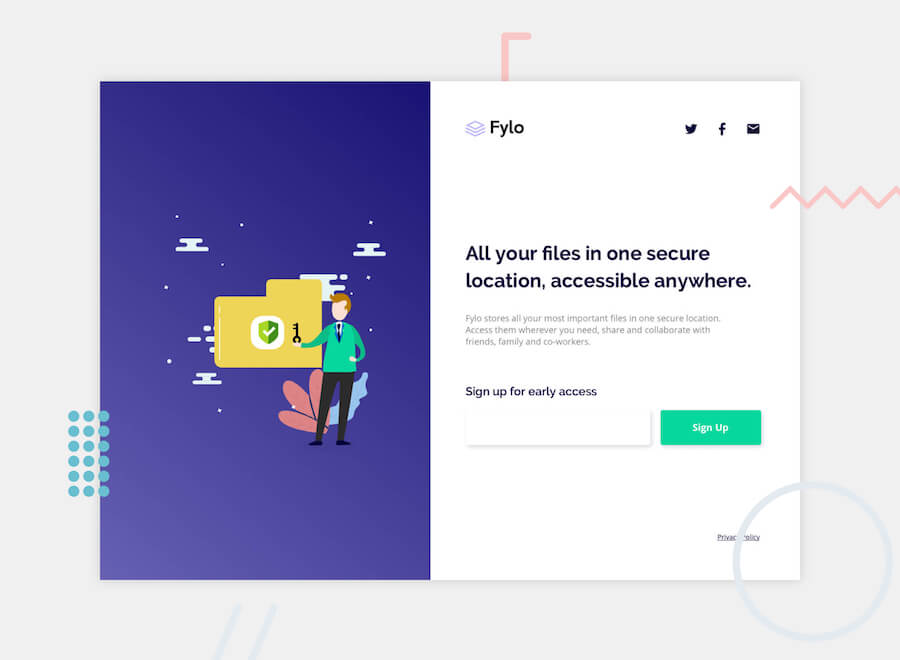

# Frontend Mentor - Beta sign up split layout

## HTML/CSS challenge project #2

Thanks for checking out this front-end coding challenge. It's based on the design brief and supplied mockups found at [Frontend Mentor](https://www.frontendmentor.io).

I'm working through these challenges to solidify my understanding of HTML and CSS, familiarise myself with a typical front end web developer's workflow, and get comfortable with using git and github. Aside from the design mockups, a style guide and images obtained from the link above, the HTML and CSS here is entirely my own work.

Since the page layout in this challenge is quite simple, I've focussed on trying to keep the HTML and CSS as semantic, efficient, clean and organised as I can. I implemented the switching of the artwork from the top to the left side for large screens by making an element for each design and using a media query at a suitable breakpoint to toggle the display of these two elements off/on. The sticky footer was created by wrapping the whole page in a flexbox column with min-height equal to 100vh, then setting the main content to flex: 1 so it grows to push the footer down to the bottom. 

Webfonts were obtained from Google Fonts and social media icons from Font Awesome.